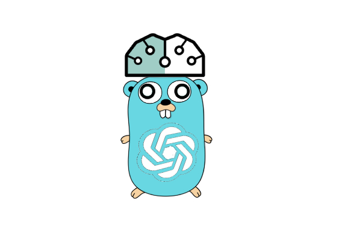
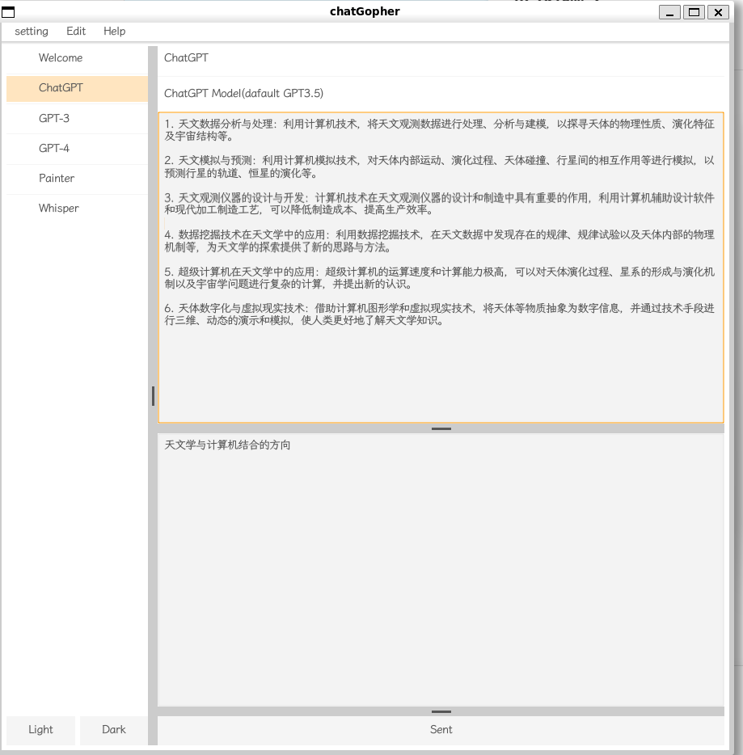

# chatGopher

  

<h1 align="center">chatGopher</h1>

GUI tool for answer your question, support chatGPT / GPT3 / GPT4 / Bard / NewBing / Audio2Text / Text2Image (Coming Soon......)

All In One,You Know

   
   
   

## 项目预览

- 解决了中文乱码问题 
  - 字体来源于开源项目 (字体)[https://github.com/lxgw/LxgwWenkaiGB]

目前因为代理原因，调用链路比较长，因此等待时间比较长

进行中。。。。